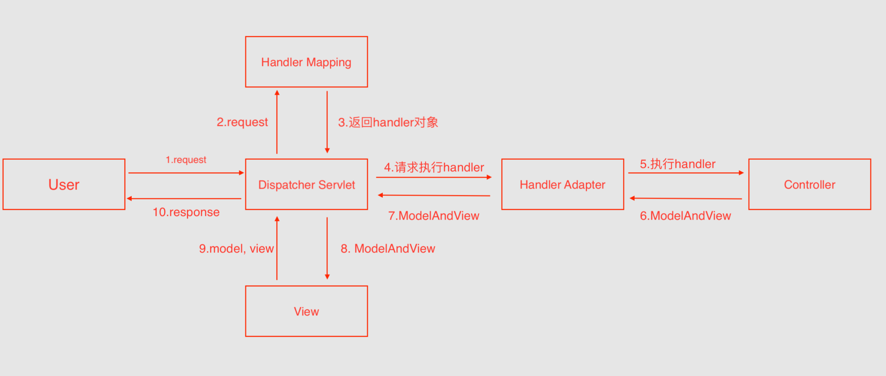

# 基础面试题

 

### 一、简述`SpringMVC`的流程

- `1` 客户端发送请求，携带`url`地址；
- `2-3` 前端控制器`Dispatcher Servlet`接收到请求，调用处理器映射`Handler Mapping`找到对应的处理器，生成并返回`handler`对象；
- `4` 前端控制器`Dispatcher Servlet`调用处理器适配器`Handler Adapter`；
- `5-7` `Handler Adapter`经过适配，调用相应的适配器执行`handler`对象斌返回结果给`Handler Adapter`，再返回给前端控制器`Dispatcher Servlet`，结果包括数据结构和视图对象；
- `8-9` 前端控制器`Dispatcher Servlet`调用视图解析器`View Resolver`将携带的数据结构和视图对象进行解析，解析完成后响应给`Dispatcher Servlet`；

- `10`核心控制器将结果返回给客户端。

