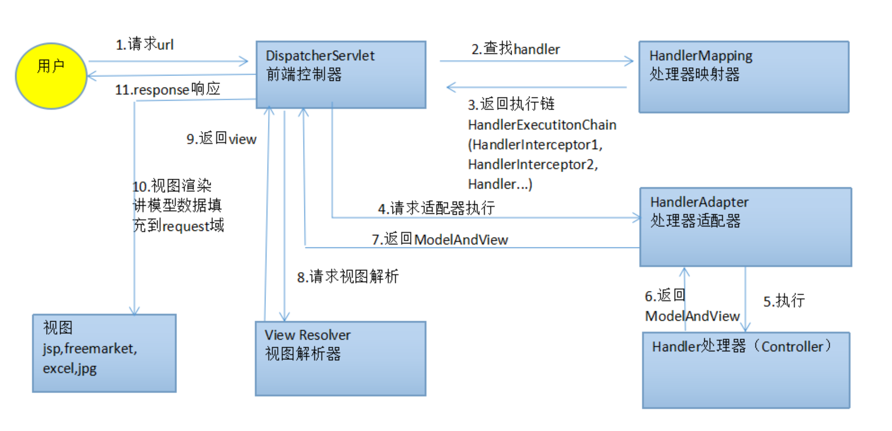

# 基础面试题

 

### 一、简述`SpringMVC`的流程

##### 图解SpringMVC执行流程：

##### SpringMVC执行流程：

- `1` 用户发送`url`请求至前端控制器`Dispatcher Servlet`；
- `2` 前端控制器收到请求后调用处理器映射器`Handler Mapping`；
- `3` 处理器映射器根据请求`url`找到具体的处理器，生成处理器执行链`HandlerExecutionChain` `包括处理器对象和处理器拦截器`一并返回给`Dispatcher Servlet`；
- `4` `Dispatcher Servlet`根据处理器`Handler`获取处理器适配器`HandlerAdapte`执行`HandlerAdapter`处理一系列的操作；
  - 如：参数封装，数据格式转换，数据验证等操作
- `5` 执行处理器`Handler`(`Controller`，也叫页面控制器)；
- `6` `Handler`执行完成返回`ModelAndView`；
- `7` `HandlerAdapter`将`Handler`执行结果`ModelAndView`返回到`DispatcherServlet`；
- `8` `DispatcherServlet`将`ModelAndView`传给`ViewReslover`视图解析器；
- `9` `ViewReslover`解析后返回具体`View`；
- `10` `DispatcherServlet`对`View`进行渲染视图（即将模型数据`model`填充至视图中）；
- `11` `DispatcherServlet`响应用户。

 

 

### 二、`MyBatis`中`ORM`的一对一映射，一对多映射，哪里用到

