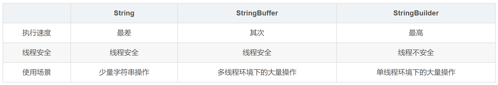

# 常问面试题

### 一、`SQL`的生命周期

- 应用服务器与数据服务器建立一个连接。
- 数据进程拿到请求的`sql`。
- 解析并生成执行计划，执行。
- 读取数据到内存并进行逻辑处理。
- 通过建立的连接`步骤一的连接`，发送到客户端。
- 关掉连接，释放资源。

<br>

<br>

### 二、事务的四大特性：`ACID`

- ##### 数据库支持事务操作要具备的四个特性：

  - 原子性`Atomicity`：事务包含的所有操作要么全部成功`必须完全运用到数据库`，要么全部回滚失败`不能对数据库有任何影响`。
  - 一致性`Consistency`：事务必须使数据库从一个一致性状态换到另一个一致性状态，也就是说一个事务执行前和执行后都必须处于一致性状态。
  - 隔离性`Isolation`：多个用户并发访问数据库时，单个事务的操作不能相互干扰，所以多个并发事务之间要相互隔离。
    - `MySQL`数据库提供的四种隔离级别：
      - `Serializable` (串行化)：可避免脏读、不可重复读、幻读的发生；
      - `Repeatable read` (可重复读)：可避免脏读、不可重复读的发生；
      - `Read committed` (读已提交)：可避免脏读的发生；
      - `Read uncommitted` (读未提交)：最低级别，任何情况都无法保证。
  - 持久性`Durability`：事务一旦被提交，对数据库的数据改变是永久性的，数据库系统遇到故障的情况下也不会丢失提交事务的操作。

<br>

- ##### 数据事务并发造成的问题：

  - 脏读：一个事务处理过程中读取了另一个未提交的事务中的数据。
  - 不可重复读：一个事务范围内多次查询却返回了不同的数据值，在查询间隔被另一个事务修改并提交了`读取了另一条已经提交的事务`。
  - 虚读（幻读）：幻读是事务非独立执行时发生的一种现象`读取了另一条已经提交的事务`。

<br>

<br>

### 三、`Redis`数据类型

- `String` `字符串、整数或者浮点数` 对整个字符串或者字符串的其中一部分执行操作；对整数和浮点数执行自增或者自减操作。
- `List` `列表` 从两端压入或者弹出元素；对单个或者多个元素进行修剪，只保留一个范围内的元素。
- `Set` `无序集合` 添加、获取、移除单个元素；检查一个元素是否存在于集合中；计算交集、并集、差集；从集合里面随机获取元素。
- `Zset` `有序集合` 添加、获取、删除元素；根据分值范围或者成员来获取元素；计算一个键的排名。
- `Hash` `包含键值对的无序散列表` 添加、获取、移除单个键值对获取所有键值对；检查某个键是否存在。

<br>

<br>

### 四、Redis的三种集群模式

- 主从模式
- 哨兵模式
- `Cluster`集群模式

<br>

<br>

### 五、`Strin`、`StringBuffer`与`StringBuilder`的区别



- `String`可以空赋值，`StringBuffer`和`StringBuilder`不行，报错；
- 操作少量的数据用`String`；
- 多线程操作字符串缓冲区下操作大量数据`StringBuffer`；
- 单线程操作字符串缓冲区下操作大量数据`StringBuilder`。
  - 底层实现，`StringBuffer`比`StringBuilder`多了`Synchronized`修饰符。

<br>

<br>

### 六、在Java中如何跳出当前的多重嵌套循环

- 可以在外层循环语句前定义一个标号，然后在内层循环体的代码中使用带有标号的`break`语句，即可跳出外层循环

```java
public static void main(String[] args) {
        public static void method1 () {
            ok:
            for (int i = 0; i < 10; i++) {
                for (int j = 0; j < 10; j++) {
                    System.out.println("i=" + i + ",j=" + j);
                    if (j == 5) {
                        break ok;//跳到循环外的ok处，即终止整个循环
                    }
                }
            }
        }
    }
```

<br>

<br>

### 七、`int`和`Integer`有什么区别

- Java提供两种不同类型：
  - 基本数据类型：`boolean`，`char`，`byte`，`short`，`int`，`long`，`float`，`double`；
  - 封装类类型：`Boolean`，`Character`，`Byte`，`Short`，`Integer`，`Long`，`Float`，`Double`。
  - 引用数据类型：`数组`、`类`、`接口`。

